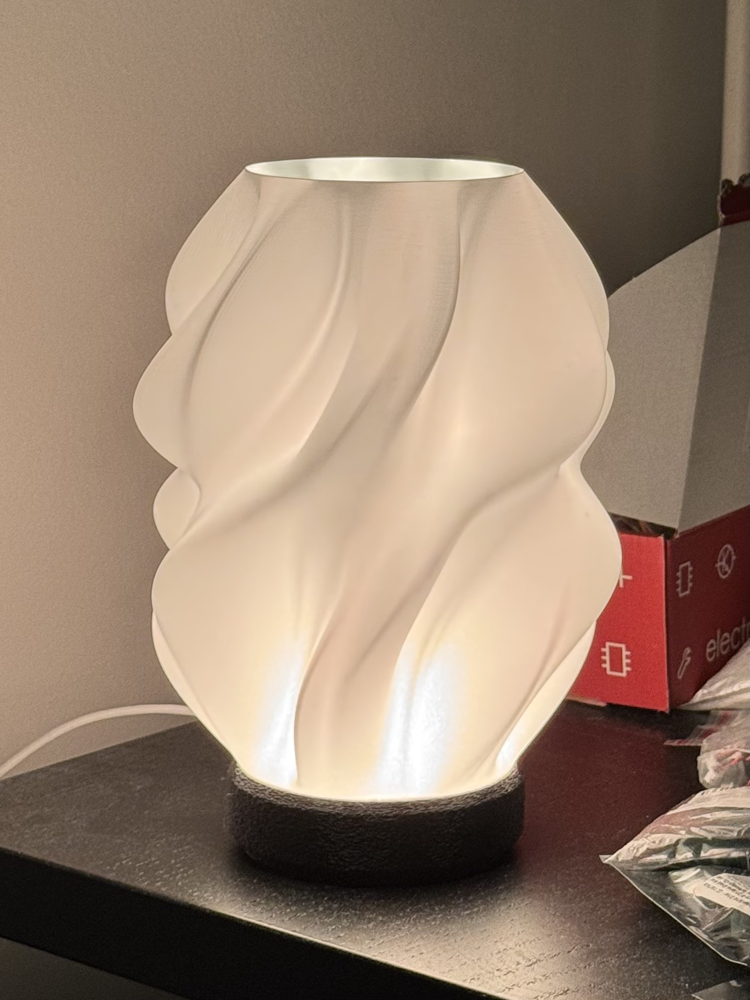
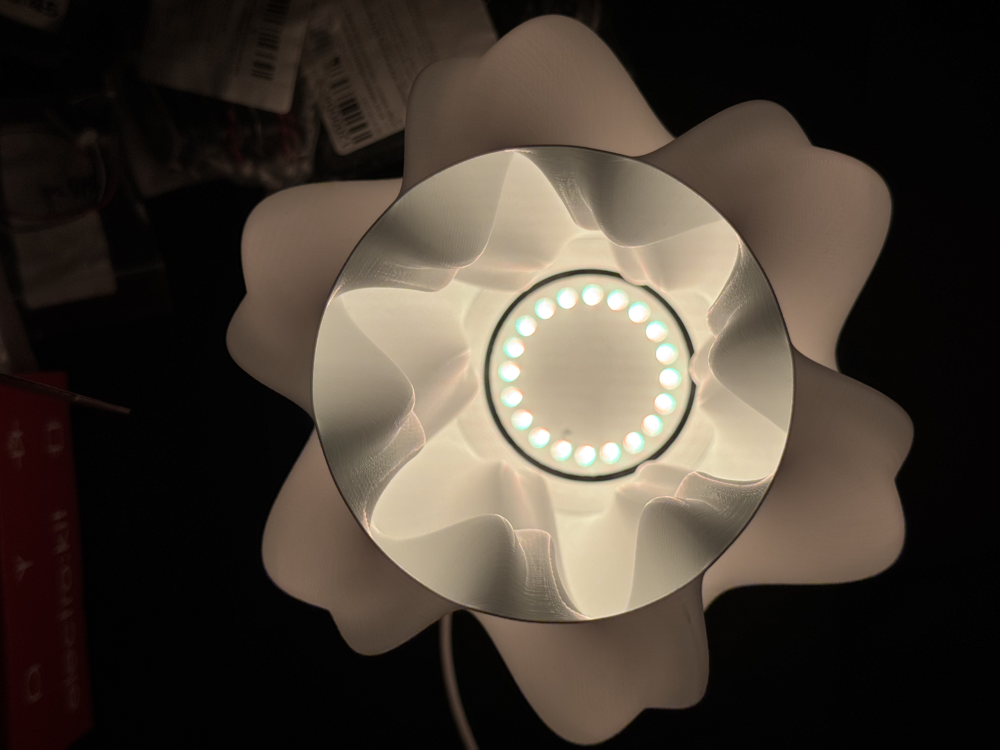

# esp32-homekit-lamp

A WS2812B LED lamp for the powered by a ESP32-C6, controllable directly from Apple HomeKit.

## Features

In the Home app you get four accessories:

- **Lamp** — dimmable color light (on/off, brightness, hue, saturation)
- **Fire** — switch that runs a flickering-flame animation
- **Breathe** — switch that slowly breathes the chosen color
- With both mode switches off, the lamp shows a solid color

Animations render one non-blocking frame per loop, so HomeKit stays responsive.

## Hardware

- ESP32-C6 
- WS2812 (20 LEDs by default)

Wiring:

GPIO17 --[470 ohm]--> DIN (LED 1), then daisy-chained out
5V  -> VDD on all LEDs
GND -> common (tie ESP32 GND to the supply GND)

## Build & flash

Built with PlatformIO:

pio run -t upload     &emsp; # build and flash

pio device monitor    &emsp; # serial monitor @ 115200

## First-time setup

Over the USB serial monitor (115200 baud):

1. Type `W` to scan for and join your 2.4 GHz WiFi network.
2. In the Home app: **Add Accessory** → enter code `466-37-726`
